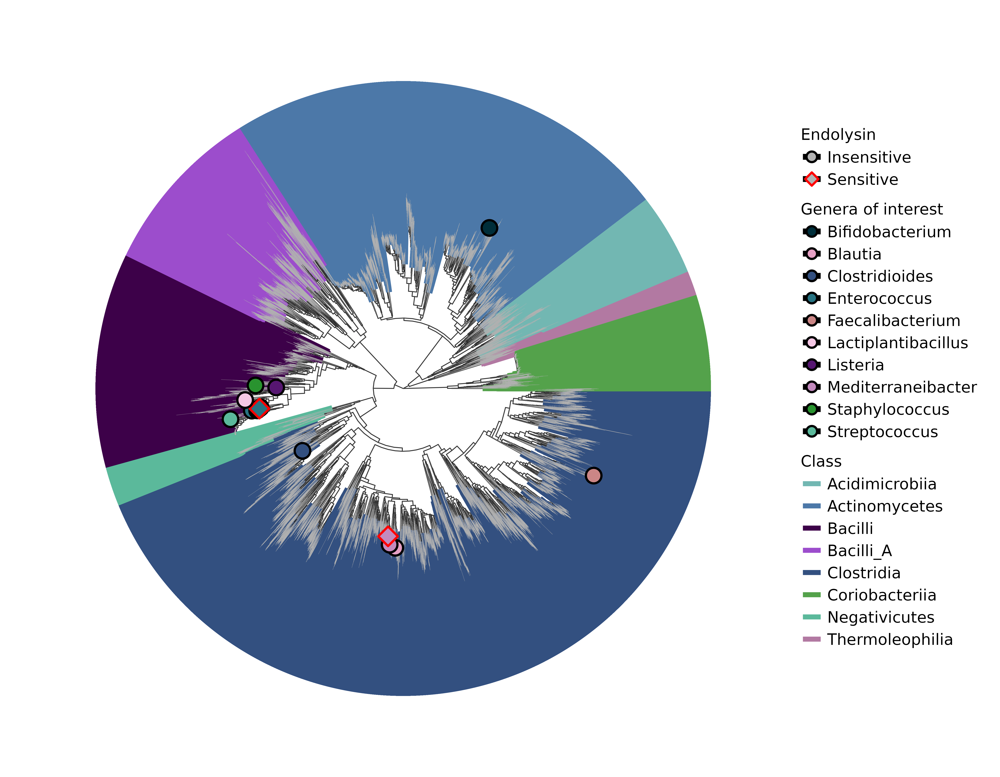

# Murray et al. (2026) LysH1
This repository contains scripts to plot phylogenetic trees of cross-class activity for LysH1.

# 
custom_taxonomy.txt is the genomes that we used as representatives or were either tested for cross-class activity vs LysH1.

# smk file 
gtdb_tree_nr_genomes.smk is the snakemake file that will generate the GTDB tree.

